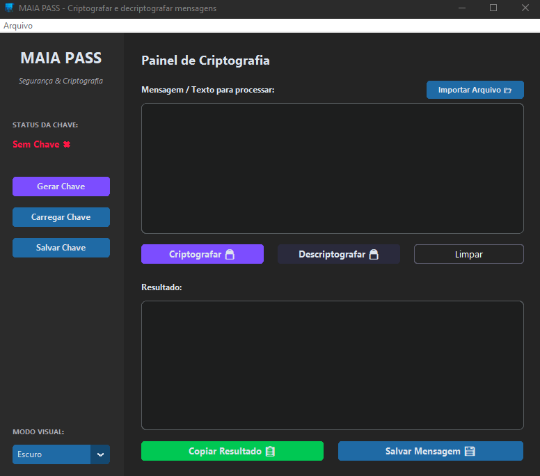
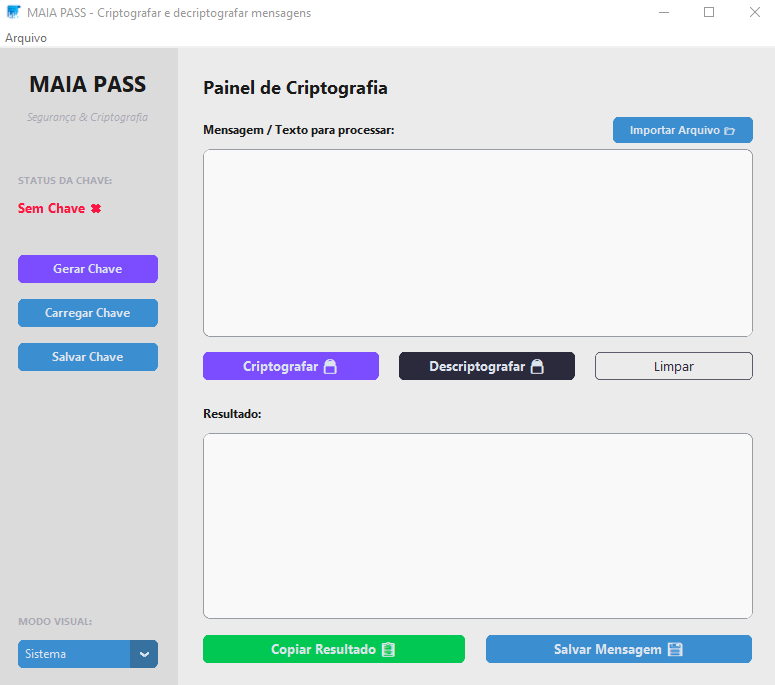
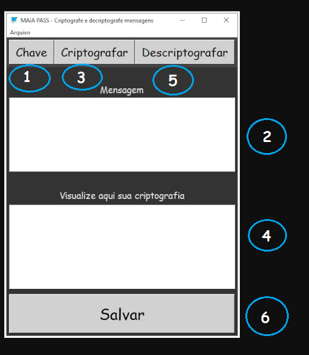
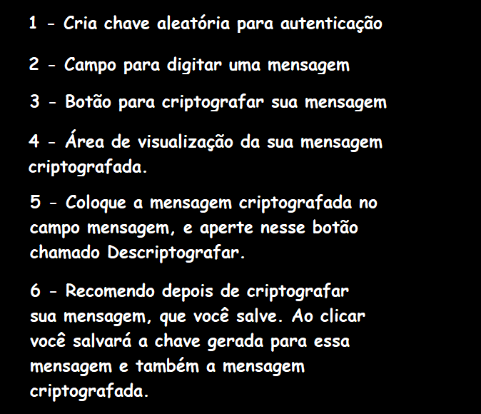
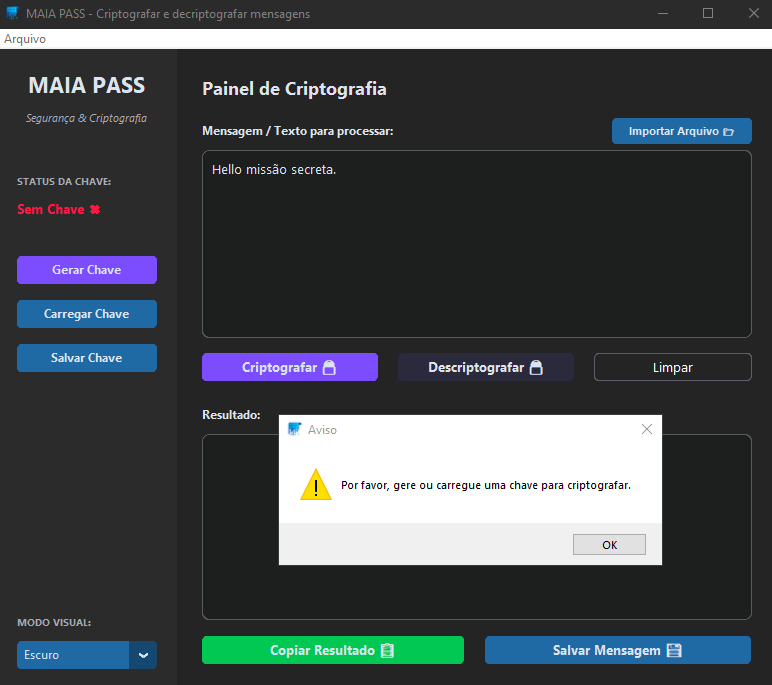
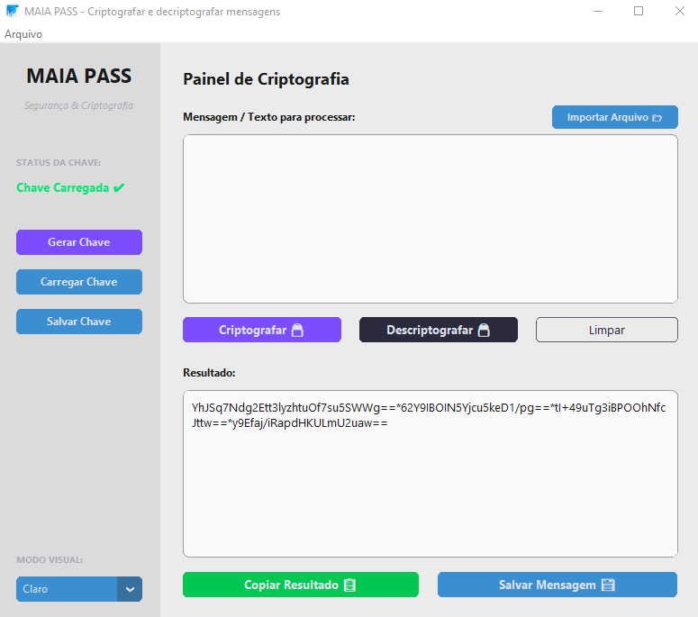

# MaiaPass 🔒

<p align="center">
  
</p>

<p align="center">
  <strong>Criptografe e descriptografe suas mensagens de forma segura, simples e elegante.</strong>
</p>

<p align="center">
  
  
  
</p>

---

## 📖 Sobre o Projeto

O **MaiaPass** é um aplicativo desktop de segurança e privacidade que permite criptografar e descriptografar textos de maneira rápida e segura. Ele conta com uma interface gráfica moderna e responsiva desenvolvida em Python utilizando a biblioteca **CustomTkinter**, trazendo uma experiência de usuário rica com suporte a temas dinâmicos (Claro, Escuro e integração com o Sistema).

Para realizar a criptografia, o sistema utiliza a biblioteca **cryptocode** e gera chaves criptograficamente fortes de 4096 caracteres usando o módulo nativo `secrets` do Python.

---

## 🚀 Funcionalidades

- 🔑 **Geração de Chaves Seguras**: Geração automática de chaves complexas com 4096 caracteres usando `secrets.choice`.
- 💾 **Gerenciamento de Chaves**: Salve suas chaves com a extensão customizada `.maiakey` ou carregue chaves existentes.
- 📝 **Processamento de Textos e Arquivos**: Criptografe e descriptografe mensagens digitadas diretamente na interface ou importadas de arquivos `.txt`.
- 📋 **Copiado Rápido**: Botão dinâmico com feedback visual instantâneo para copiar os resultados para a área de transferência.
- 🎨 **Interface Moderna e Responsiva**: Design limpo e moderno com adaptação de layout e suporte nativo ao modo escuro (Dark Mode).
- 🛡️ **Segurança Ativa**: Limpeza automática do campo de entrada original após a criptografia para evitar que a mensagem original fique exposta na tela.

---

## 📸 Demonstração e Capturas de Tela

### Interface do Usuário (Modo Claro & Escuro)
O aplicativo integra-se de forma dinâmica às preferências visuais do seu sistema.

#### Visual do Programa (Modo Escuro / Dark Theme)
<p align="center">
  
</p>

#### Visual do Programa (Modo Claro / Light Theme)
<p align="center">
  
</p>

---

### Fluxo de Funcionamento (Tutorial Passo a Passo)

O fluxo básico consiste em carregar ou gerar uma chave, inserir a mensagem e processá-la.

| Passo 1: Geração e Carregamento de Chave | Passo 2: Criptografando Mensagem |
|:---:|:---:|
|  |  |

| Passo 3: Copiando o Resultado Gerado | Passo 4: Descriptografando Mensagem |
|:---:|:---:|
|  |  |

---

### Logos do Projeto

Temos duas variações principais do logotipo do projeto MaiaPass:

| Variação 1 (Logotipo Principal) | Variação 2 (Logotipo Alternativo) |
|:---:|:---:|
|  |  |

---

## 🛠️ Instalação e Configuração

### Pré-requisitos
- **Python 3.11** ou superior instalado no seu sistema.

### 1. Criar e Ativar Ambiente Virtual (Recomendado)

Crie um ambiente virtual para gerenciar isoladamente as dependências do projeto.

**No Windows:**
```powershell
# Criação do venv
python -m venv venv_windows

# Ativação do venv
.\venv_windows\Scripts\activate
```

**No Linux:**
```bash
# Criação do venv
python3 -m venv venv_linux

# Ativação do venv
source venv_linux/bin/activate
```

### 2. Instalação das Dependências

Com o ambiente virtual ativo, instale as dependências executando:

```bash
pip install -r requerimentos.txt
```

### 3. Verificar o Módulo Tkinter

O CustomTkinter depende do módulo nativo `tkinter` do Python. Para validar se você já o possui instalado no seu ambiente, execute no terminal:

```bash
python -m tkinter
```
*Se o tkinter estiver funcionando, uma pequena janela gráfica de teste surgirá na tela.*

---

## 🎮 Como Executar

Com as dependências instaladas e o ambiente ativo, inicie a aplicação executando o script principal:

```bash
python main.py
```

---

## 📦 Como Gerar o Executável (.exe ou binário)

Se você deseja empacotar o aplicativo como um executável de arquivo único sem console para distribuição rápida, utilize o **PyInstaller**. Os arquivos `.spec` já estão devidamente configurados no diretório do projeto.

### Compilando usando arquivos .spec

**No Windows:**
```powershell
pyinstaller MaiaPass.spec
```

**No Linux:**
```bash
pyinstaller MaiaPassLinux.spec
```

### Compilando via Comando Direto (Alternativa)

Se preferir gerar sem ler o spec:

**No Windows (utiliza `;` como separador):**
```powershell
pyinstaller --noconfirm --onefile --windowed --add-data "icones;icones" --icon "icones/favicon512.png" --name "MaiaPass" main.py
```

**No Linux (utiliza `:` como separador):**
```bash
pyinstaller --noconfirm --onefile --windowed --add-data "icones:icones" --icon "icones/favicon512.png" --name "MaiaPass" main.py
```

O arquivo gerado ficará disponível na pasta `/dist`.

---

## 📃 Licença

Este projeto é licensed sob os termos da licença [MIT](file:///c:/Users/luiz.eduardo/Documents/MaiaPass/LICENSE).

---

## 👥 Créditos

- Ícones de criptografia criados por [kerismaker - Flaticon](https://www.flaticon.com/br/icones-gratis/criptografar).
